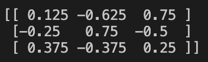
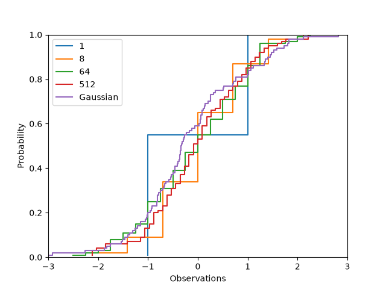

# HW0 Programming
In each of your answers, list all your collaborators (human or AI), as well as any
materials that you consulted (except those on the course website).
## Q1: Linear algebra in NumPy

**A inverse**

**A inverse times b**

**A times c**

## Q2: The central limit theorem, empirically

**Smallest n**

Part (iv) from the math section states E[(F̂ₙ(x) − F(x))²] ≤ 1/(4n) for all x ∈ R, so 1/(4n) ≤ 0.0025 gives n ≥ 100. n = 100 is the smallest n that satisfies this bound.

**Empirical CLT**

