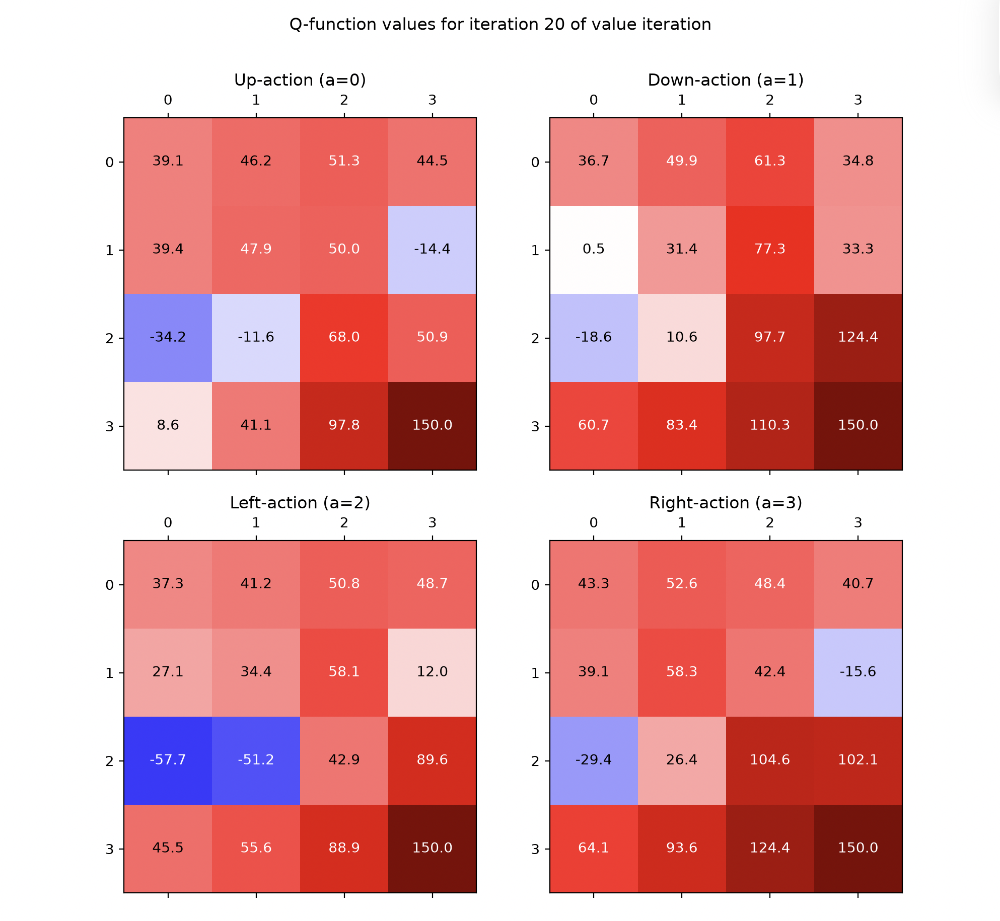
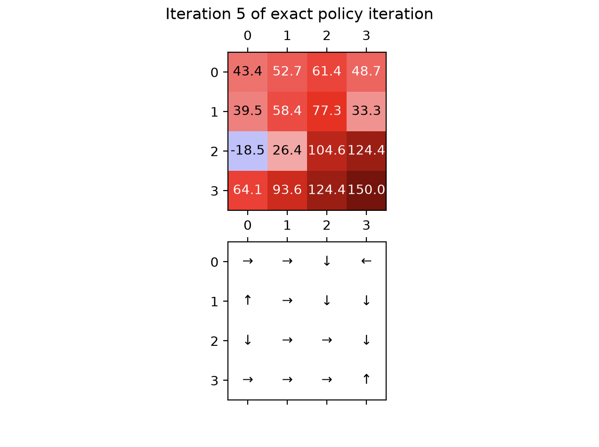
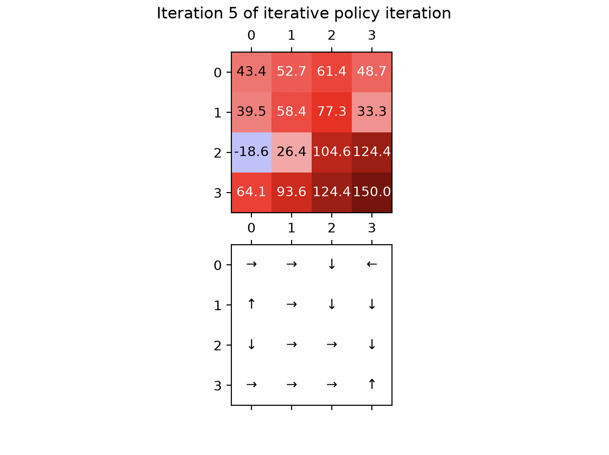

# HW1 Programming

In each of your answers, list all your collaborators (human or AI), as well as any materials that you consulted (except those on the course website).

## Value Iteration with the Q-function

Default initialization

## Policy Iteration

Default initialization

